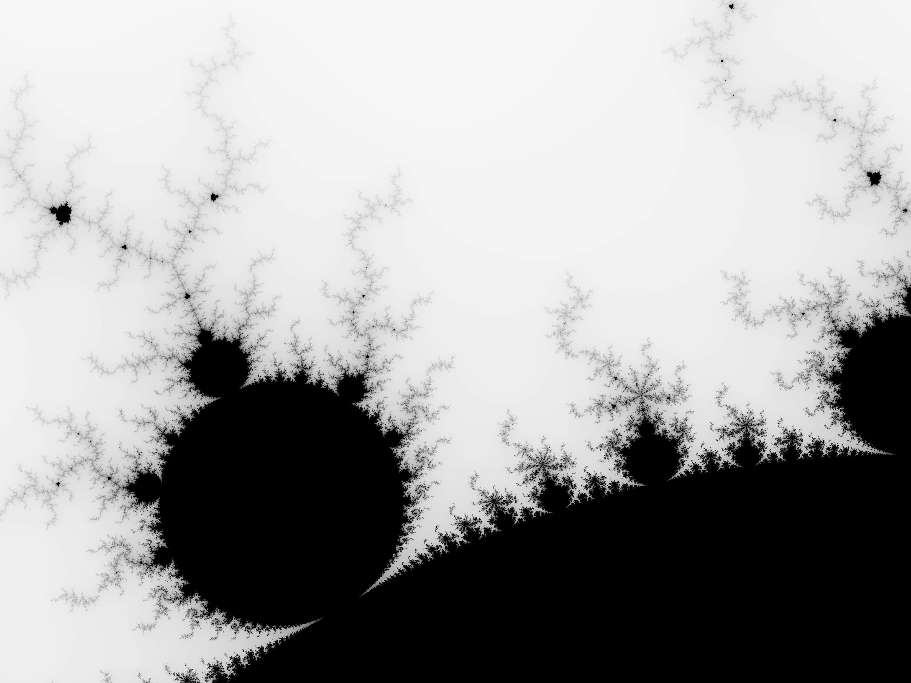

# RUSTELBROT

`rustelbrot` is a Rust command-line program that plots the [Mandelbrot Set](https://en.wikipedia.org/wiki/Mandelbrot_set).


## Installation

Build using your local rust installation 

```bash
git clone https://github.com/zazu7765/rustelbrot.git

cd rustelbrot

cargo build --release
```

or grab a binary from [Releases](https://github.com/zazu7765/rustelbrot/releases) if it is available

## Usage

```sh
./target/release/rbrot <file> <PIXELSxPIXELS> <upper_left> <lower_right> <threads>
```

Example: 
`rustelbrot test.png 4000x3000 -1.20,0.35 -1,0.20 32`

Will produce:

## Contributing

Currently Looking for:
- custom complex type
- custom color changing
- better folder/file pathing
- multiple generation

Pull requests are welcome. For major changes, please open an issue first
to discuss what you would like to change.

Please make sure to update tests as appropriate.

## License
GPL3
